# MicroService_Using_Docker
# گزارش آزمایش
## راه‌اندازی اولیه سرویس‌ها و دیتابیس
پروژه‌ای که در نظر گرفتیم، یک فروشگاه ساده است که در آن کاربران، محصولات و سفارش‌ها تعریف شده‌اند. همچنین اطلاعات این سه سرویس که به هم مربوط هستند همگی در یک پایگاه داده رابطه‌ای Postgresql ذخیره می‌شود. برای پیاده‌سازی سرویس‌های دسترسی به دیتابیس از فریم‌ورک Flask در زبان پایتون استفاده کردیم. در کد Flask مربوط به هر سرویس ابتدا جدول مورد نظر تعریف شده و ساخته می‌شود. و سپس برای هر نوع از ریکوئست‌هایی که عملیات CRUD را انجام می‌دهند، توابعی مربوط به endpoint های مربوط تعریف شده است. برای مثال قطعه‌کدهای زیر به ترتیب برای تعریف جدول کاربر و تابع اجرای درخواست POST روی آن است.

## بررسی عملکرد سرویس‌ها با اجرای عادی
حال پیش از راه‌اندازی داکر ابتدا سرویس ایجاد شده را روی یک دیتابیس postgres محلی و اجرای محلی به وسیله Flask تست می‌کنیم تا از صحت عملکرد کد سرویس‌ها مطمئن شویم.
ابتدا دیتابیس محلی را راه‌اندازی کرده و از اتصال آن روی پورت ۵۴۳۲ مطمئن می‌شویم.

سپس کد مربوط به سرویس کاربران را اجرا کرده و پورت ۵۰۰۰ برای دسترسی به آن باز می‌شود.

یک نکته قابل توجه این است که در این حالت در کد سرویس لینک دسترسی به دیتابیس باید با مشخصات درست مشخص شده باشد:

حال از نرم‌افزار postman برای ریکوئست زدن به پورت باز شده استفاده کرده و نتیجه را مشاهده می‌کنیم.

ایجاد یک رکورد جدید:

مشاهده تمام رکوردها:

مشاهده یک رکورد خاص:

آپدیت یک رکورد خاص:

مشاهده رکورد آپدیت شده:

حذف یک رکورد خاص:

تلاش برای مشاهده رکورد حذف شده (مدیریت خطا):

همانطور که دیدیم کدها در اتصال به دیتابیس برای انجام تمامی عملیات درست کار می‌کنند. سرویس‌های محصول و سفارش نیز درست مشابه سرویس کاربر عمل می‌کنند. به این ترتیب که هر محصول شامل id، نام و قیمت بوده و هر سفارش شامل id، مقدار، id محصول و id کاربر است که کلیدهای خارجی به جداول محصول و کاربر در دیتابیس هستند و جداول دیتابیس به این صورت به هم متصل هستند.

حال می‌خواهیم برای هر یک از این سرویس‌ها یک داکرفایل ایجاد کنیم که یک ایمیج داکر برای هر سرویس بسازد. همچنین لازم است دیتابیس را نیز با استفاده از داکر اجرا کنیم به این ترتیب باید کاری کنیم که بدون اجرای مستقیم هیچ کدام از سرویس ها روی کامپیوتر میزبان این سرویس‌ها بتوانند با اجرا روی هرسیستمی به صورت همزمان با یکدیگر ارتباط داشته باشند و همه سرویس‌ها از دیتابیس مشترک استفاده کنند.
## ساخت Dockerfile ها و اجرای سرویس‌ها با داکر
### سرویس دیتابیس
برای ایجاد سرویسی که یک دیتابیس ساده postgres را به وسیله داکر اجرا کند ابتدا یک فایل به نام init.sql می‌سازیم و در آن دیتابیس و کاربر آن را initialize می‌کنیم.
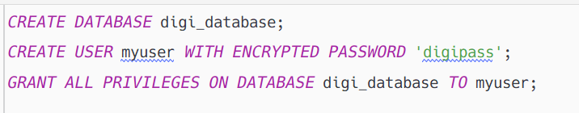
حال داکرفایل مربوط به آن را می‌سازیم.
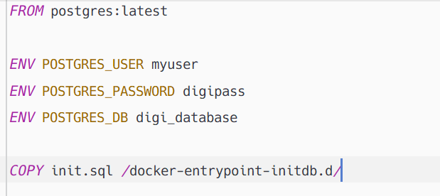
حال داکر فایل را بیلد کرده و اجرا می‌کنیم. در حین اجرا چون پورت ۵۴۳۲ سیستم توسط خود postgres درگیر است پورت ۵۴۳۳ دستگاه را به پورت ۵۴۳۲ کانتینر مپ می‌کنیم.
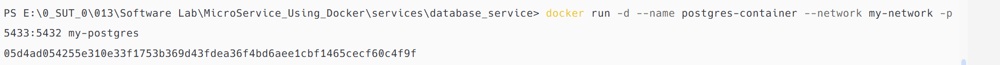
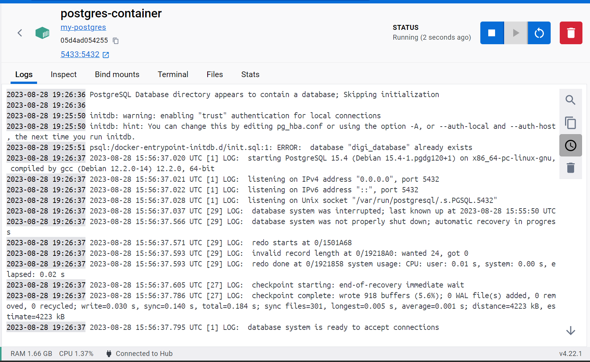
همانطور که در لاگ کانتینر مشاهده می‌کنیم هم‌اکنون دیتابیس در پورت ۵۴۳۳ دستگاه ما قابل دسترسی است. نکته قابل توجه این که برای اینکه دیتابیس و سایر سرویس‌ها به هم دسترسی داشته باشند لازم بود یک شبکه مجازی به نام my-network بسازیم و همه سرویس‌ها را روی آن شبکه اجرا کنیم.
### سرویس‌های دسترسی به دیتابیس
حال سرویس‌های کاربر، سفارش و محصول را نیز در ایمیج‌های جداگانه بیلد کرده و اجرا می‌کنیم. برای مثال داکرفایل مربوط به سرویس یوزر را مشاهده می‌کنیم.
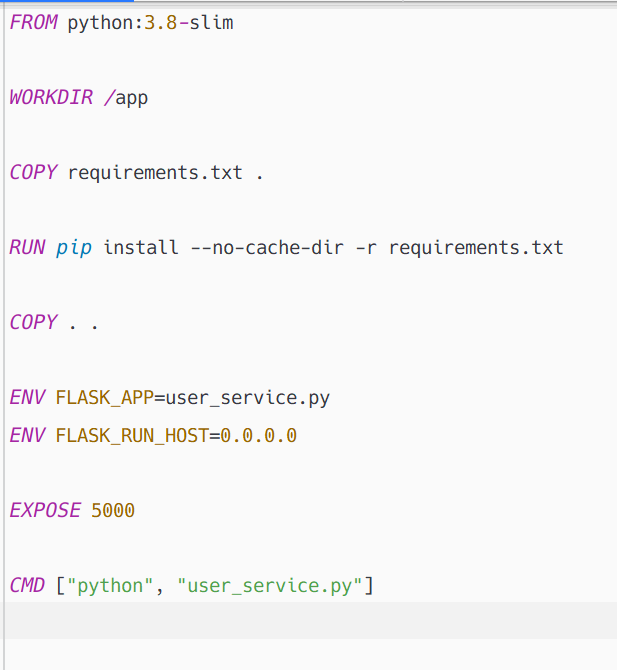
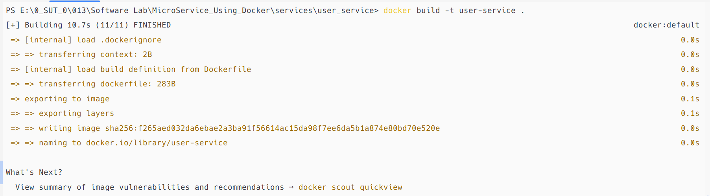
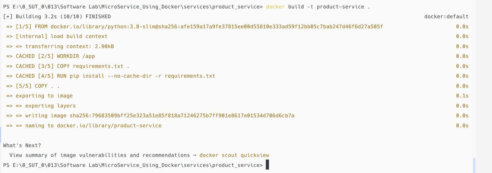
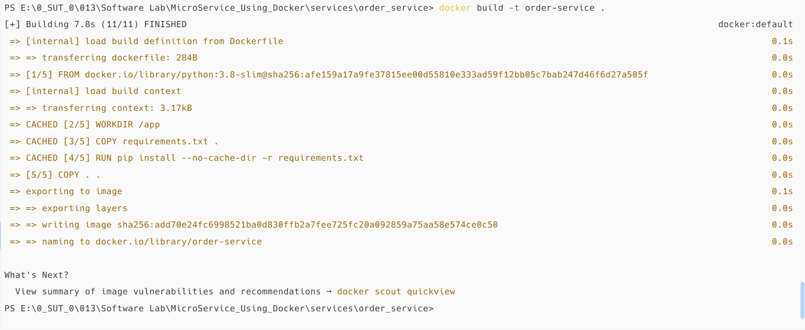
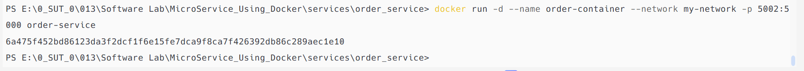
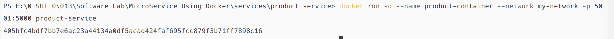
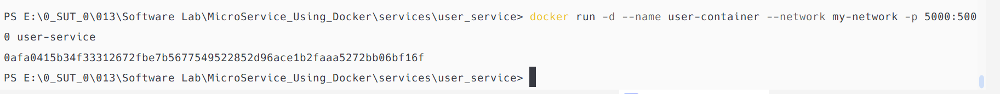
## تست درست کار کردن
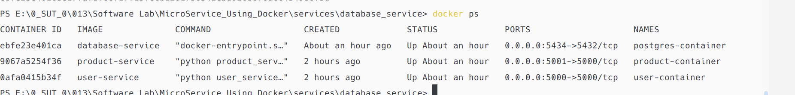
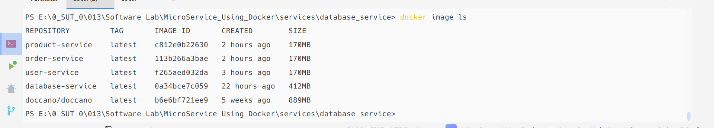
این بار در حالی که دیتابیس و سرویس‌ها روی داکر در حال اجرا شدن هستند به آنها از طریق نرم‌افزار postman ریکوئست میزنیم و از طریق مرورگر هم قابل مشاهده است.
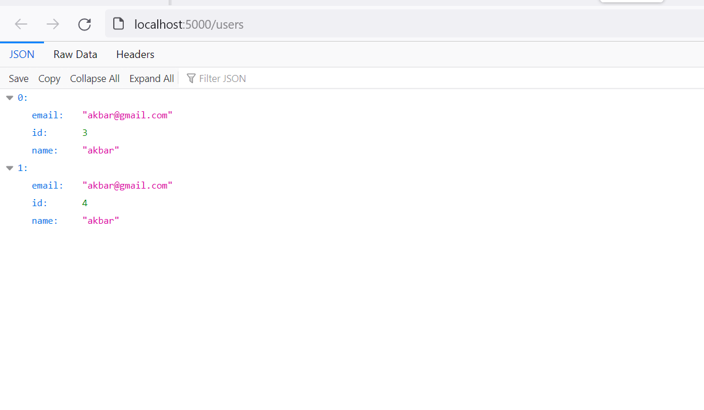
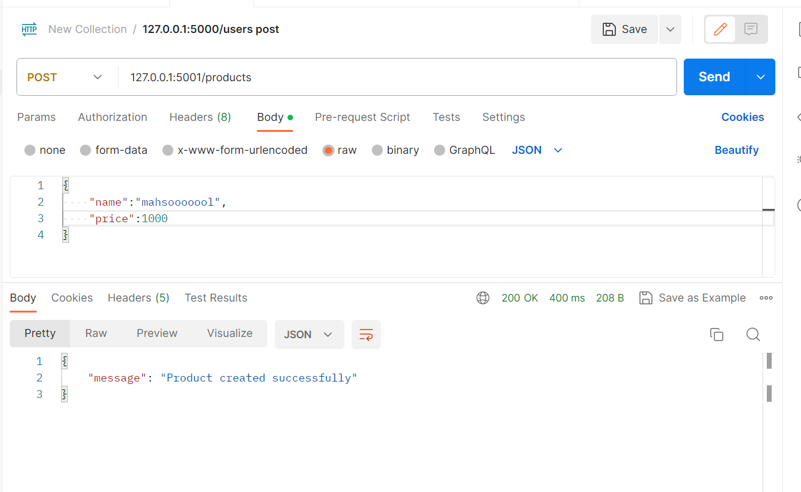
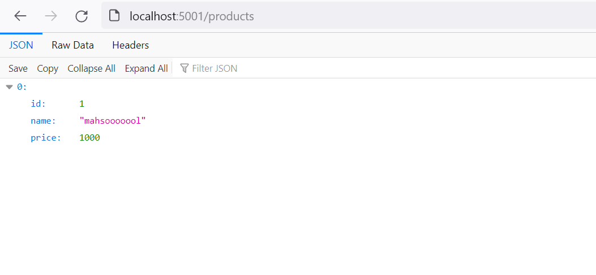

## رسم نمودار UML
از نمودار Component استفاده می‌کنیم:

# پرسش‌ها
## ۱
یک روش مناسب برای بصری‌سازی معماری میکروسرویس استفاده از Component diagram هاست. به این شکل که هر سرویس (برای مثال سرویس دیتابیس، سرویس کاربران، محصولات و...) تحت عنوان یک Component با نام service در نمودار حضور پیدا می‌کنند و endpoint های هر سرویس پورت‌هایی هستند که حین اجرا از آن طریق با سایر سرویس‌ها ارتباط برقرار می‌کند. 
## ۲
می‌توان گفت میکروسرویس یک معماری نرم‌افزار است که در آن کل نرم‌افزار به سرویس‌های مجزایی تقسیم می‌شود که هم مفاهیم مستقلی دارند و هم به صورت نسبتا مستقل اجرا می‌شوند و فقط در سطح اجرا سرویس‌ها با هم ارتباط دارند. در مقابل میکروسرویس که همانطور که ذکر شد یک روش معماری است، می‌توان گفت DDD یک رویکرد است که در سطوح مختلف قابل اجرا و پیگیری است برای مثال می‌توان در نرم‌افزاری با معماری میکروسرویس از روش طراحی DDD استفاده کرد. 

در واقع به جداسازی منطقی داده‌ها و اجزای برنامه DDD گفته می‌شود. ممکن است هرکدام از این دامنه‌های جداسازی شده یک میکروسرویس باشند. در عمل می‌توان از یک طراحی DDD در ابتدا کمک گرفت تا میکروسرویس‌ها را به طور دقیق‌تری پیدا کرد.

## ۳
بله. docker compose یک ابزار orchestraition است. ابزارهای orchestraition به طور کلی ابزارهایی هستند که به خودکارسازی و مدیریت ساده‌تر وظایف زیرساختی کمک می‌کنند. برای مثال کارهایی مانند تخصیص منابع به کانتینرها، کانفیگ و اجرای آن‌ها، ایجاد قابلیت‌های خودکار load-balancing و... توسط این ابزارها خودکارسازی شده و بسیار راحت‌تر قابل مدیریت هستند. docker-compose نیز ابزاری دقیقا به همین منظور است. به این شکل که بعد از ایجاد Dockerfile ها می‌توان با یک فایل docker-compose.yml تمام فرآیند build و اجرای ایمیج‌ها در کانتینرها را خودکارکرد به طوری که پس از هر ویرایش یا تغییر در پیکربندی کانتینرها مجبور به بیلد مجدد تک‌تک آن‌ها نباشیم و با اجرای docker-compose بتوانیم تمامی تسک‌های مربوط را به ترتیب اجرا کنیم. به این ترتیب docker-compose یک ابزار قدرتمند جهت ساده‌سازی عملیات‌های مربوط به کانتینرهای داکر است که با حدف عملیات تکراری و خودکارسازی و یکپارچه‌سازی روند به کاربر کمک به سزایی می‌کند.